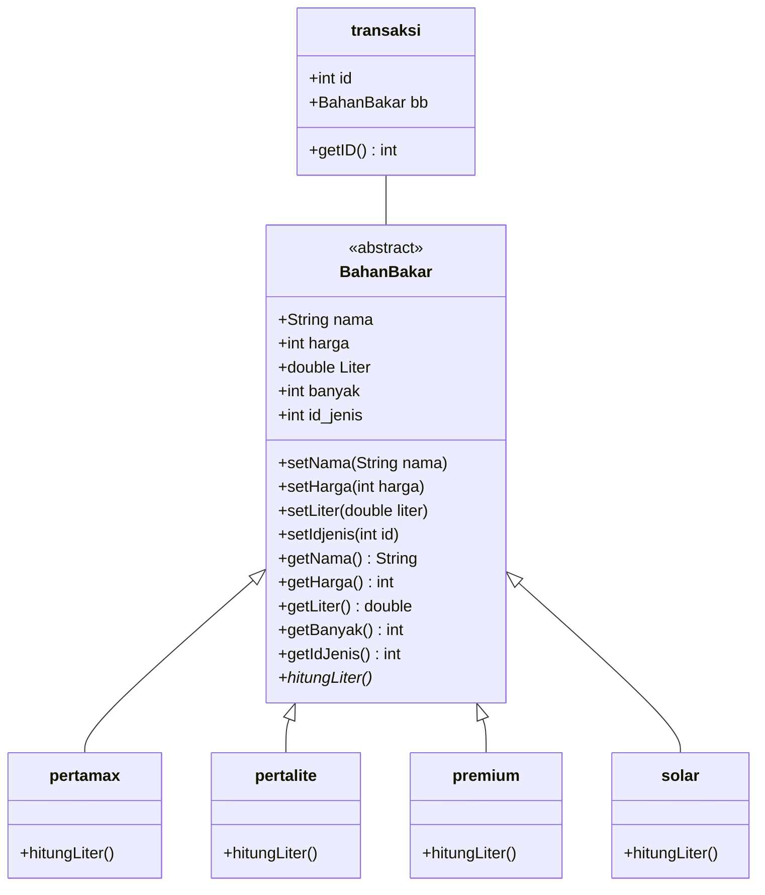

# Nama Anggota
- RifkyPerdanaPutra 1807051033
- Berdo Nagoya 1807051024

# Final Project PBO

'SI Pertamini' merupakan Sistem Informasi yang dapat digunakan untuk menginput data Penjualan UMKM Pertamini.
### Class Diagram


### ER Diagram
```mermaid
erDiagram
          transaksi }|..|{ BahanBakar : to
          BahanBakar ||--|| pertamax : is
          BahanBakar ||--|| pertalite : is
          BahanBakar ||--|| premium : is
          BahanBakar ||--|| solar : is
          
    transaksi{
        int id
        BahanBakar bb
    }
    BahanBakar{
        String nama
        int harga
        double Liter
        int banyak
        int id_jenis
    }
    ```
